# 赛博书屋

刷到一段好视频、听到一期播客、看到一篇长文，把链接发给你平时用的
ChatGPT / Codex、Claude 或 WorkBuddy。电脑读取它能合法获取的内容，整理成带
来源、摘要、逐字稿、截图和结构图的 Markdown 笔记，放进你自己的
Obsidian。

Codex 或 Claude 用户如果愿意授权，还可以同时生成一份飞书文档副本。

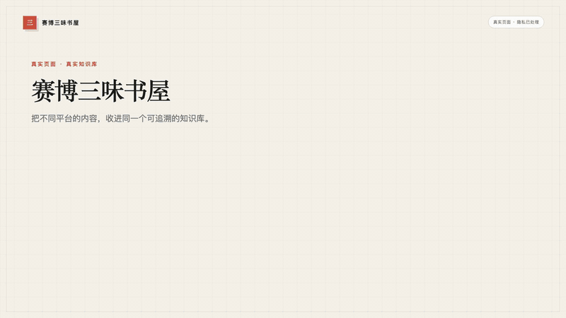

> 动图由真实公开页面和单独建立的 Obsidian 脱敏演示库录制。
> [观看 42 秒完整演示（VoiceBox 雷厉旁白）](assets/demo/cyber-bookhouse-demo.mp4)。

## 30 秒看懂

```text
文章、视频、播客或本地文件
            ↓
Codex / Claude / WorkBuddy（电脑、手机、飞书、微信助理）
            ↓
   同步笔记 / 蒸馏笔记 / 详细拆解
            ↓
Obsidian 本地原件 → 可选的飞书文档副本
```

它不是新的笔记软件，也不是在线内容平台。它是一套符合
[Agent Skills 开放规范](https://agentskills.io/specification)、交给桌面 Agent
安装的 Skill，笔记原件仍然在你的电脑上。

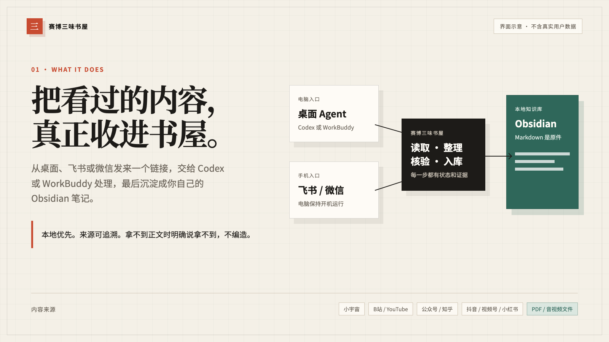

## 最后会得到什么

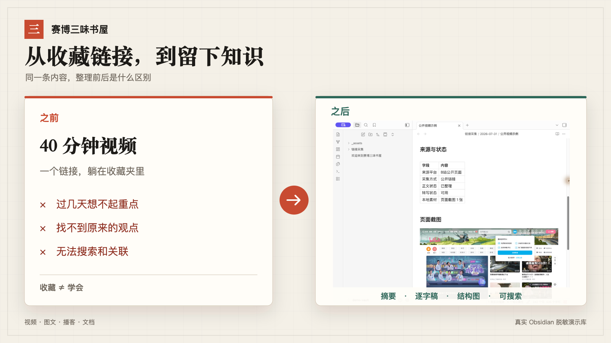

笔记里会留下原始链接、采集时间、内容状态、摘要、逐字稿或翻译，
以及实际取得的页面截图。拿不到的部分会标明，不用标题和封面补出正文。


上图是真实 Obsidian 窗口，并非仿造界面。它来自一个专门建立的
`demo-vault`，不包含个人账号、本机路径或私人知识库内容。

## 能整理哪些内容

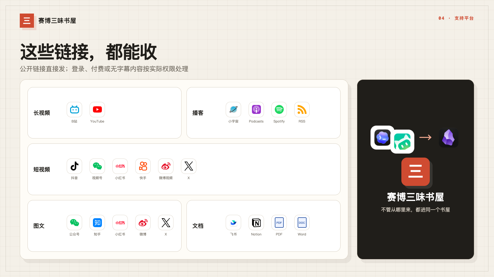

| 内容类型 | 常见来源 |
| --- | --- |
| 🎧 播客、音频 | 小宇宙、Apple Podcasts、Spotify、公开 RSS、本地音频 |
| 🎬 长视频 | B站、YouTube、本地视频 |
| 📱 短视频 | 抖音、视频号、小红书、快手、微博视频、X 视频 |
| 📰 图文 | 微信公众号、知乎、小红书、今日头条、百家号、搜狐号、微博、X、普通网页 |
| 📄 文档 | 飞书文档、公开 Notion、PDF、Word、Markdown、TXT、PPT |

“能整理”不等于任何链接都能完整下载。公开页面和你自己提供的文件通常
可以直接处理；遇到登录、付费内容、没有字幕或平台限制时，它会明确说明
缺了什么，再让你选择授权的可见浏览器、官方导出或本地文件。

例如 YouTube 要求“确认你不是机器人”时，书屋会停止重复抓取，只询问
是否读取已登录页面上可见的字幕；不自动导出浏览器 Cookie。

## 一条链接，三种笔记

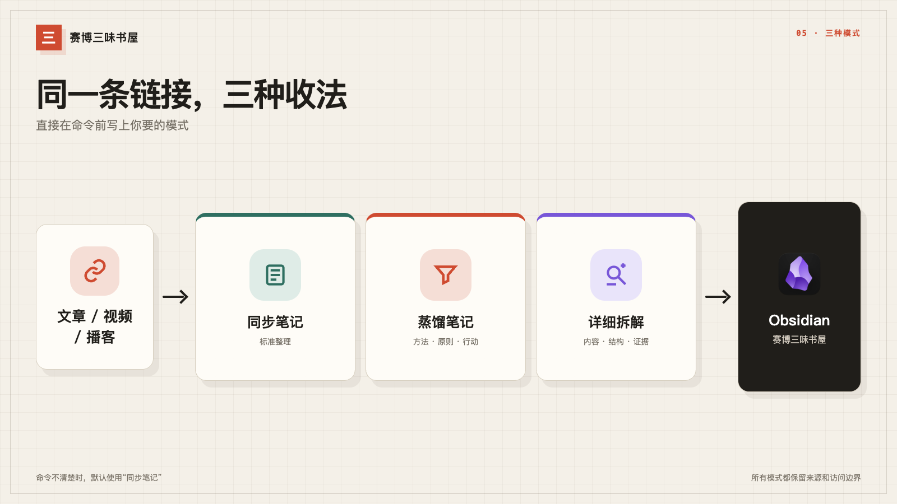

| 命令 | 会得到什么 | 适合 |
| --- | --- | --- |
| 📖 `同步笔记` | 视频简单总结、逐字稿和必要翻译；图文正文总结 | 学习、记录、留档 |
| 🧪 `蒸馏笔记` | 详细的结构、表达、方法、反例和失效边界 | 短片拉片、框架学习 |
| 🔍 `详细拆解` | 完整包含“同步笔记”和“蒸馏笔记” | 深度研究、后续创作 |

`收进书屋：链接` 仍然可以使用，等同于“同步笔记”。

### 三种模式实际长什么样

下面用两篇公开内容做真实案例：《Open Design Team：让多个 Codex 在同一
设计画布中实时协作》和《Seeing like an Agent》。三张图均为 Obsidian 1.13.4
阅读视图实拍；公开来源链接保留，拍摄时关闭文件列表，个人账号、本机路径和
私人关联笔记均未进入画面。

**同步笔记**：总结、核心内容、带时间点的逐字稿和必要翻译。

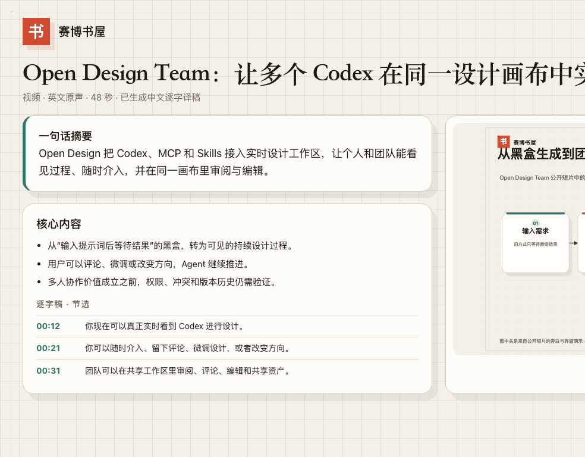

**蒸馏笔记**：内容骨架、方法、反例与失效边界。


**详细拆解**：把前两种结果放在同一篇笔记里，同时保留证据路径。

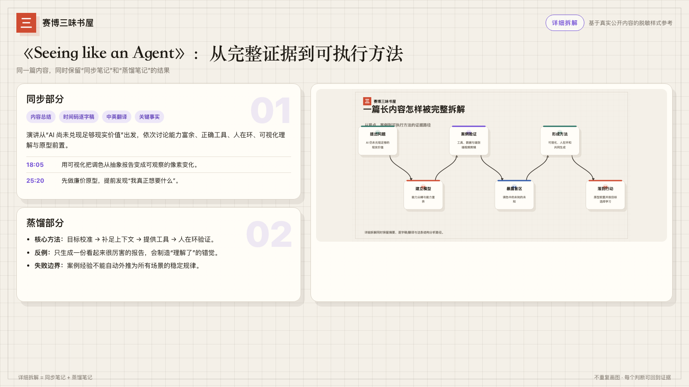

原内容真的有 SOP、多条分支、方法框架或明显叙事节奏时，书屋会适当生成
本地 SVG 和 HTML 结构图；只有一两步或证据不足时，不会为了好看硬塞图。

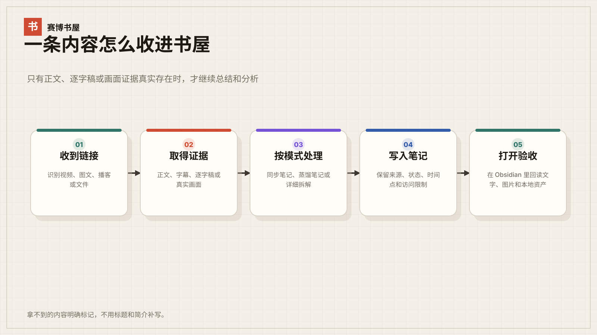

## 在哪些系统上用

| 系统 | 当前状态 | 说明 |
| --- | --- | --- |
| macOS | ✅ 稳定 | 安装向导和核心路线已经做过真机测试 |
| Windows 10 / 11 | 🧪 Beta | 路径、PowerShell、应用检测和转写路线已适配；安装后必须在当前 Windows 电脑上完成真实测试 |
| Linux | — | 本版暂不提供自动安装向导 |

Codex 已有官方 Windows 应用；WorkBuddy 的官方页面提供 Windows 版和
Windows 10+ 安装指南。详细的 Windows 路径和验收见
[第一次安装](INSTALL.md)。

## 从哪里发链接

| 你平时用什么 | 电脑上 | 手机上 | 还可以接 |
| --- | --- | --- | --- |
| ChatGPT / Codex | Codex | ChatGPT 手机端 | 飞书入口、微信助理（通过 WorkBuddy）、飞书文档 |
| Claude | Claude Code | 飞书或微信助理 | 飞书入口、微信助理（通过 WorkBuddy）、飞书文档 |
| WorkBuddy | WorkBuddy | WorkBuddy 手机端 | 飞书、微信助理 |

已经在用 ChatGPT，就走 Codex 这条路；已经在用 Claude，就走 Claude；已经
在用 WorkBuddy，就走 WorkBuddy。
不选择微信助理时，不用为了书屋把两边都装一遍；Codex 用户主动选择微信
助理后，Codex 会继续引导安装或打开 WorkBuddy，并让它写入同一个书屋。
手机远程入口依赖电脑保持在线。

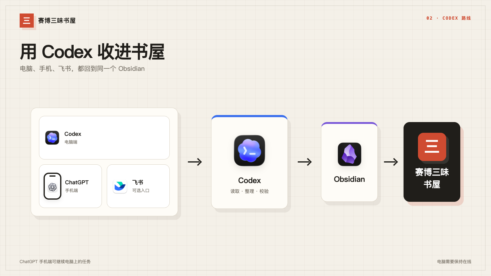

Codex 和 Claude 默认把 Markdown 原件写入 Obsidian。完成飞书官方授权和真实读回测试后，
也可以同时生成飞书文档副本。飞书入口负责“从哪里发”，飞书文档负责
“整理后放到哪里”，是两件事。

Claude 使用同一份 Skill 和同一个 Obsidian 书屋。它不虚构一个未经核实的
Claude 手机入口：需要在手机上发链接时，接飞书，或让 WorkBuddy 微信助理
把微信消息送进同一个书屋。

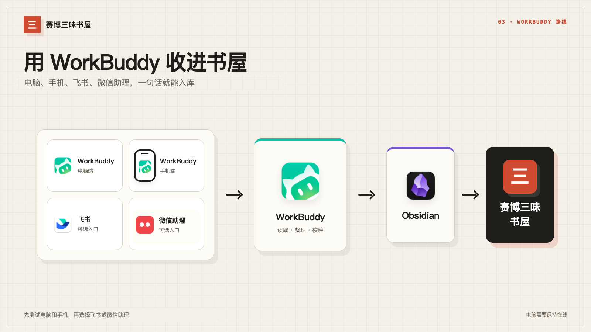


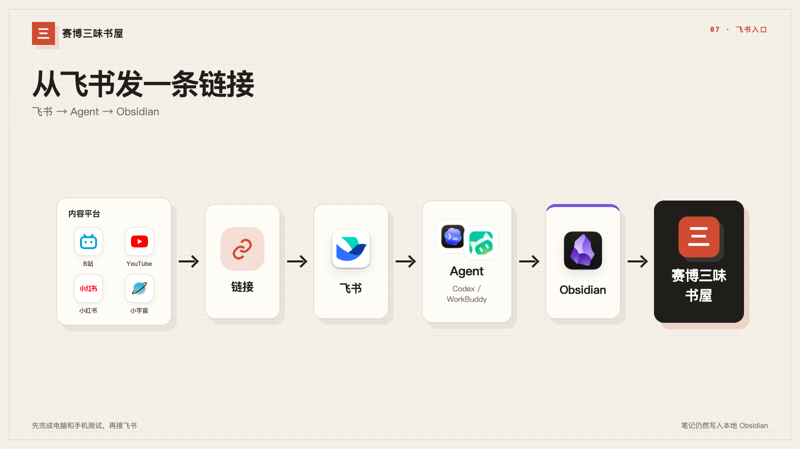

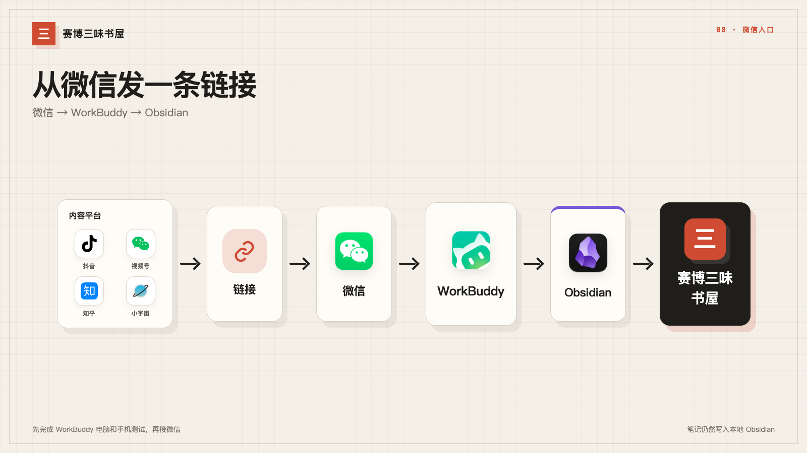

## 一分钟体验

安装完成后，在电脑、手机或已连接的入口里发送：

> 同步笔记：`https://www.youtube.com/watch?v=DEMO_VIDEO_ID`

把示意地址换成你自己的文章、视频或播客链接。处理结束后，你会收到
笔记路径、获取状态和未取得内容的说明；Obsidian 里会出现可搜索的结果。

## 第一次怎么装

1. 安装 [Obsidian](https://obsidian.md/download)。
2. 安装你已经在用的桌面工具：
   [Codex](https://openai.com/index/introducing-the-codex-app/)、
   [Claude Code](https://code.claude.com/docs/en/overview) 或
   [WorkBuddy](https://www.codebuddy.cn/work/)。
3. 从 [Releases](https://github.com/Raven7979/cyber-bookhouse/releases/latest)
   下载 `cyber-bookhouse.zip`。
4. 按[第一次安装](INSTALL.md)把同一份 Skill 交给 Codex、Claude 或 WorkBuddy。
5. 对它说：

> 请用 cyber-bookhouse Skill 帮我搭好赛博书屋。请识别当前是 Codex、Claude 还是
> WorkBuddy，先完成软件、Obsidian 和当前路线要求的真实测试，之后再问我
> 要不要增加飞书入口、微信助理或飞书文档。每次只说一个操作，最后运行
> 包内能力检查，告诉我哪些内容能直接处理。

新建书屋时，macOS 的默认目录是 `~/Documents/cyber-bookhouse`，Windows 是
`%USERPROFILE%\Documents\cyber-bookhouse`。对你仍然称为“赛博书屋”。

向导会先用 Obsidian 的“打开文件夹作为仓库”注册目录，再做当前路线要求的
真实写入测试。基础测试通过后，才会询问是否增加飞书、微信助理或飞书文档。

## 下载包里有什么

`cyber-bookhouse.zip` 包含：

- Codex、Claude Code 和 WorkBuddy 共用的一份开放标准 Skill；
- 可恢复备份并回读验证的 Codex / Claude 用户级安装器；
- 安装状态、输入通道和真实测试记录；
- macOS 与 Windows 路径、应用和依赖检查；
- 普通公开网页、YouTube 公开字幕和本地音视频处理；
- 同步笔记、蒸馏笔记、详细拆解和结构图生成规则；
- Obsidian、飞书文档及各入口的写入和读回验收。

它不依赖维护者电脑上的私人 Skill。`yt-dlp`、FFmpeg、Whisper、Obsidian 和
飞书工具仍从各自官方来源安装，仓库不重新打包第三方程序。

## 怎样才算真的装好了

- 电脑端发一个测试链接，Obsidian 里出现可读笔记。
- 选择了手机入口时，它能继续同一个工作，并收到处理结果。
- 如果另外接了飞书或微信助理，它们写入的是同一个书屋。
- 如果选了飞书文档，测试文档能创建、能读回、能由用户打开。
- 包内能力检查已运行，缺少的外部工具和受限平台被如实报告。

电脑关机、深度睡眠或断网时，本机 Agent 无法继续处理新内容。

## 它怎样工作

1. 检查当前系统、桌面 Agent、Obsidian 和所需依赖。
2. 按内容类型选择最少侵入的获取方式：公开页面、授权后的可见内容或用户文件。
3. 根据用户命令生成对应模式，只用真实取得的正文、逐字稿和画面做分析。
4. 写入 Obsidian 中的 Markdown 原件和本地素材，再打开验收。
5. 用户选择飞书文档时，在本地原件成功后再生成副本并读回。

## 有几件事先说清楚

- Windows 目前是 Beta，需要真实 Windows 用户继续回报不同机器的安装结果。
- 不绕过登录、验证码、付费墙、DRM、访问频率限制或平台权限。
- 不要求你把密码、Token、Cookie、私人文档或 Obsidian 库交给项目维护者。
- 只能拿到标题和链接时，就只保存标题和链接，不假装已经看过正文或视频。

隐私细节见 [PRIVACY.md](PRIVACY.md)，安全问题见 [SECURITY.md](SECURITY.md)。

`v0.2.0` 是当前公开版本，新增 Claude Code 与三端通用安装包；macOS 稳定，
Windows 10 / 11 仍为 Beta。不同内容
平台仍需要继续拿真实样本逐个测试。
