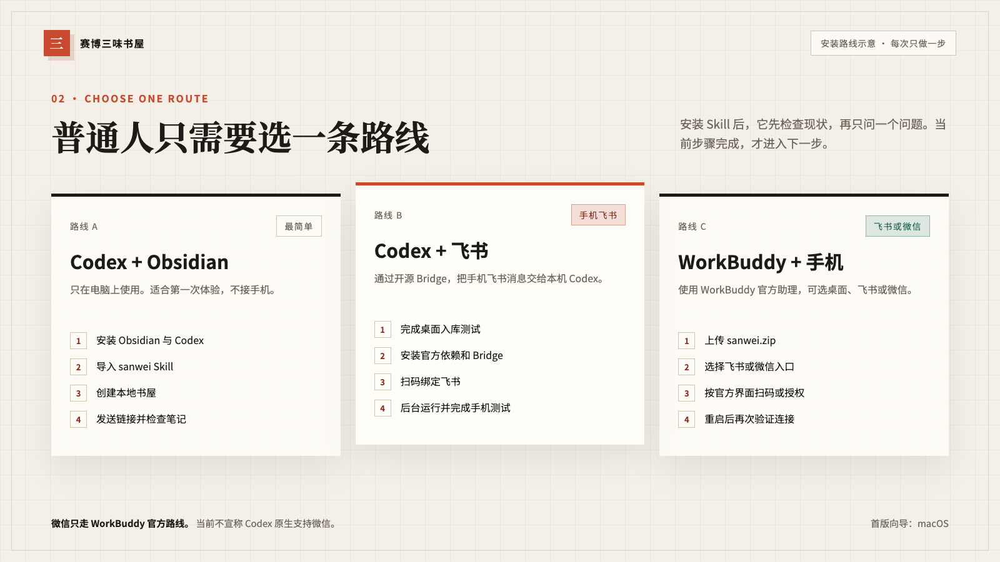
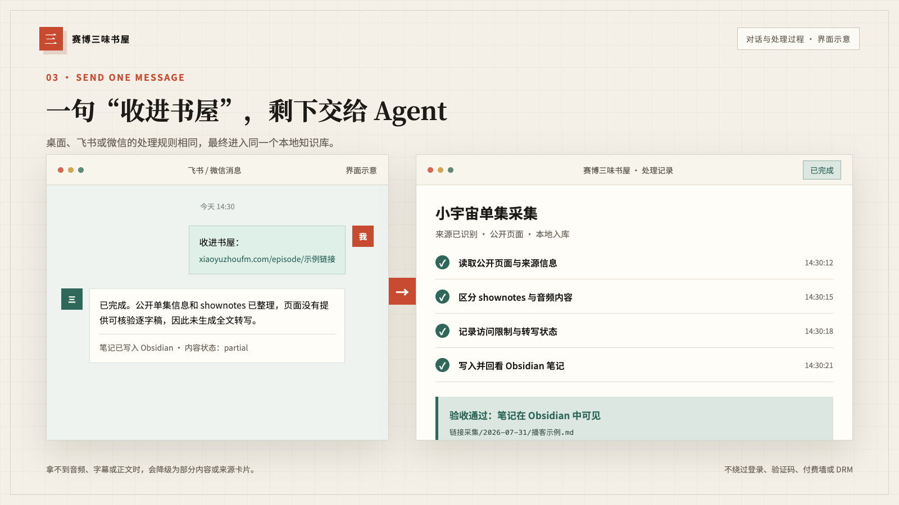
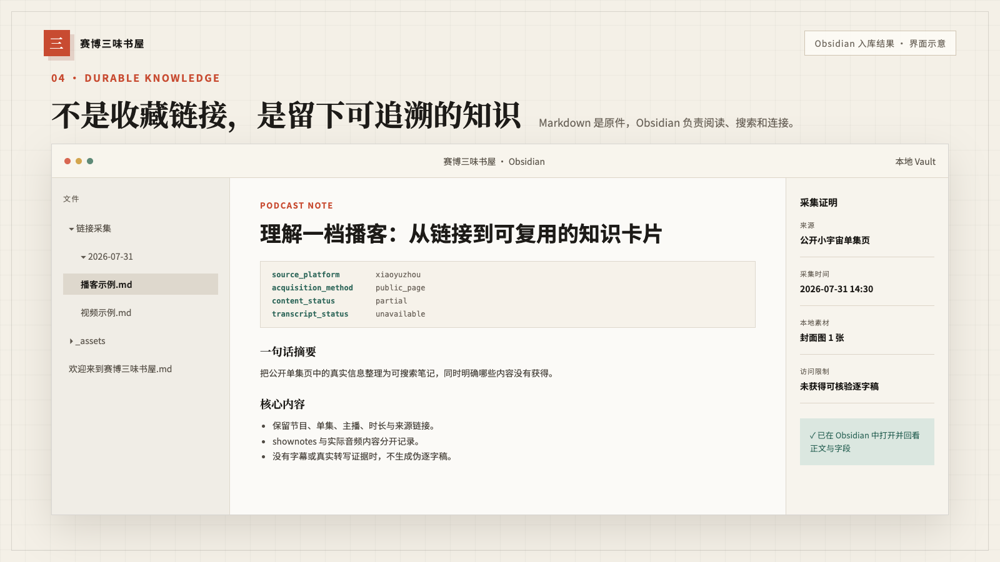

# 赛博三味书屋

刷到一段好视频、听到一期播客、看到一篇长文，当时觉得有用，过几天却
怎么也找不到了。

赛博三味书屋想解决的就是这件小事：把链接发给你平时用的 ChatGPT 或
WorkBuddy，电脑把能读到的内容整理好，连同来源、摘要、截图和转写一起
放进 Obsidian。以后想找，不必再翻聊天记录和收藏夹。

它不是一个新的笔记软件，也不是在线内容平台。它是一套可以交给桌面
Agent 安装的 Skill；笔记仍放在你自己的 Obsidian 里。

## 先选你已经在用的那个

| 你平时用什么 | 电脑上 | 手机上 | 还可以接 |
| --- | --- | --- | --- |
| ChatGPT / Codex | Codex | ChatGPT 手机端 | 飞书 |
| WorkBuddy | WorkBuddy | WorkBuddy 手机端 | 飞书、微信 |

已经在用 ChatGPT，就走 Codex 这条路；已经在用 WorkBuddy，就走
WorkBuddy。不用为了这套书屋把两边都装一遍。

Codex 可以从 ChatGPT 手机端查看和继续电脑上的任务；WorkBuddy 也有自己
的移动端远程入口。飞书和微信是额外入口，不是手机使用的前提。具体可看
[OpenAI 的 Codex 手机端说明](https://openai.com/index/work-with-codex-from-anywhere/)
和
[WorkBuddy 的移动端远程说明](https://www.codebuddy.cn/docs/workbuddy/From-Beginner-to-Expert-Guide/Practice-Cases/Practice-Six)。

## 第一次怎么装

1. 安装 [Obsidian](https://obsidian.md/download)。
2. 安装你选择的桌面工具：
   [Codex / ChatGPT](https://chatgpt.com/download/) 或
   [WorkBuddy](https://www.codebuddy.cn/work/)。
3. 从 [Releases](https://github.com/Raven7979/cyber-sanwei/releases/latest)
   下载 `sanwei.zip`。
4. 按[第一次安装](INSTALL.md)把 Skill 交给 Codex 或 WorkBuddy。
5. 对它说：

> 请用 sanwei Skill 帮我搭好赛博三味书屋。请识别我当前使用的是 Codex
> 还是 WorkBuddy，先完成软件、Obsidian 和手机测试，之后再问我要不要增加
> 飞书或微信。每次只说一个操作，最后请用真实测试确认手机和电脑都能把
> 笔记写进 Obsidian。

软件安装程序都从各自官网下载安装，这个仓库不重新打包。

第一次安装时，它会帮你选好 Obsidian 文件夹、接通手机入口，再用一个
示例链接做测试。新建书屋的磁盘目录使用英文名
`~/Documents/cyber-sanwei`，在欢迎页和操作提示中仍称为“赛博三味书屋”。
看到测试笔记真的出现在 Obsidian 里，才算装完。

向导会先把基础书屋和手机端完整测通，之后才问是否增加飞书或微信，不会
在安装开始时用路线选择打断流程。

## 平时怎么用

全部安装完成后，向导会给出三种命令。在 ChatGPT、Codex、WorkBuddy、飞书
或微信中，把链接或文件发出去，并说：

> 同步笔记：`https://www.bilibili.com/video/BV1xxxxxxxxx`

- `同步笔记`：日常标准笔记。
- `蒸馏笔记`：只提炼可复用的方法、原则和行动清单。
- `详细拆解`：标准笔记 + 蒸馏结果 + 内容结构分析。

`收进书屋：链接` 仍然可以使用，等同于“同步笔记”。

下面是用演示数据做的流程图，不包含真实账号或私人笔记：

整理完成后，Obsidian 里的笔记会保留来源、采集时间、正文状态和转写
状态。哪部分没有拿到，会直接写明白，不会拿标题和封面凑一篇“完整总结”。

## 能整理哪些内容

| 内容类型 | 常见来源 |
| --- | --- |
| 播客、音频 | 小宇宙、Apple Podcasts、Spotify、公开 RSS、本地音频 |
| 长视频 | B站、YouTube、本地视频 |
| 短视频 | 抖音、视频号、小红书、快手、微博视频 |
| 图文 | 微信公众号、知乎、小红书、今日头条、百家号、搜狐号、微博、普通网页 |
| 文档 | 飞书文档、公开 Notion、PDF、Word、Markdown、TXT、PPT |

这里的“能整理”不等于“任何链接都能完整下载”。公开页面和你自己提供的
文件通常可以直接处理；遇到登录、付费内容、没有字幕或平台限制时，它会
告诉你缺了什么，并让你选择授权浏览器、官方导出或自己提供文件。更细的
边界写在[内容平台说明](skills/sanwei/references/content-platforms.md)里。

## 什么样才算真的装好了

- 电脑端发一个测试链接，Obsidian 里出现可读的笔记。
- 手机端也能继续同一个工作，并收到处理结果。
- 如果另外接了飞书或微信，它们写入的是同一个 Obsidian 书屋。
- 笔记里的来源、正文、图片或视频截图能够正常打开。
- 电脑重新登录后，不需要重新从头配置。

手机远程入口依赖电脑在线。电脑关机、深度睡眠或断网时，本机 Agent
无法继续处理新内容。

## 有几件事先说清楚

- 第一版安装向导先按 macOS 做了完整测试。
- 不绕过登录、验证码、付费墙、DRM、访问频率限制或平台权限。
- 不要求你把密码、Token、Cookie、私人文档或 Obsidian 库交给项目维护者。
- 只能拿到标题和链接时，就只保存标题和链接，不假装已经看过正文或视频。

隐私细节见 [PRIVACY.md](PRIVACY.md)，安全问题见
[SECURITY.md](SECURITY.md)。

## 现在做到哪一步

`v0.1.0` 是第一个公开预览版。macOS 安装向导、Codex / WorkBuddy、
手机入口、飞书 / 微信选项、Obsidian 笔记格式和内容边界已经放进仓库。
不同内容平台仍需要继续拿真实样本逐个测试。
